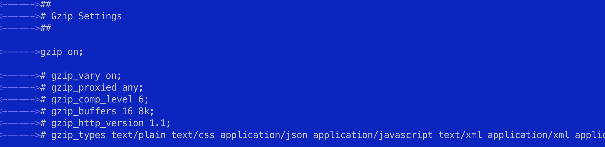
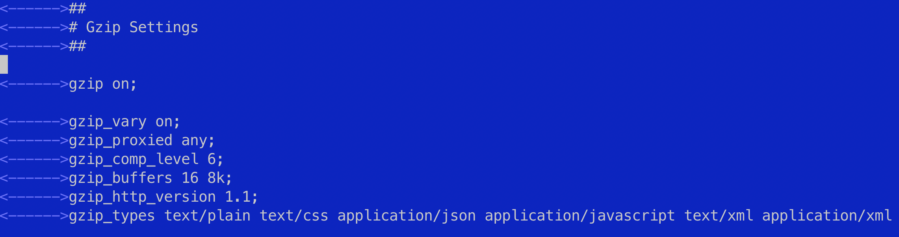

[На главную](/){ .md-button }
##

# Публикуем сайт на vsp сервере. nginx. ssl


!!! note "steps"
    1. Купить сервер
    2. Настроить ресурсные записи
    3. Рассмотрим публикацию сайта (статические файлы) на уделенный сервер 
    4. Настроим nginx 
    5. Подключим ssl


---
## #Ресурсные записи -> домен -> сервер
после покупки сервера мы связываем доменное имя с нашим сервером, данные по работе с сервером приходят на указанную вами почту или их можно взять в личном кабинете сервиса в котором покупался сервер


* `настроить ресурсные записи в regru` - Позволит соединить доменное имя с купленным сервером

заходим в регру, выбираем доменное имя, изменить ресурсные записи, добавляем ip нашего сервера: 

* `в запись @` 
* `и в www`


---
## ssh

### Сгенерировать ключ
```
ssh-keygen -t rsa
```

### Вывести ключ в терминал
```
cat ~/.ssh/id_rsa.pub
```

### Скопировать ключ на удаленный сервер
После ввода команды, введите пароль (не будет отображаться) и нажмите ENTER. Утилита скопирует содержимое открытого ключа (~/.ssh/id_rsa.pub) на удаленный сервер в файл authorized_keys.
```
ssh-copy-id root@00.000.000.000
```

### Если соединение быстро обрывается можно использовать эту команду
```
ssh -o ServerAliveInterval=60 root@00.000.000.000
```

### Зайти на сервер по ssh
```
ssh root@00.000.000.000
```


---

## Обновите список пакетов
    sudo apt update


---


## Учетные записи

### меняем пароль пользователя ROOT
при вво­де сим­волы не отоб­ража­ются — нет ни букв, ни цифр, ни звез­дочек, это нор­маль­но, вве­ди новый пароль и наж­ми Enter
```
passwd
```

---

### добавить учетную запись
следуйте инструкциям, чтобы установить пароль и заполнить другую информацию
```
adduser coder
```

### добавить права суперпользователя для пользователя coder
добавьте пользователя coder в группу sudo, используя команду
```
usermod -aG sudo coder
```

### проверьте, что пользователь добавлен в группу sudo, выполните команду
```
groups coder
```


---
## #Установка программ

### Обновите список пакетов
    sudo apt update

### MCeditor
Midnight Commander — один из файловых менеджеров с текстовым интерфейсом типа Norton Commander для UNIX-подобных операционных
```
sudo apt install mc
```

### Установите git
* `git --version` - проверить установлен ли git
```
git --version
```

```
sudo apt install git
```

### Установите Nginx
    sudo apt install nginx

### Полезные команды Nginx
```
sudo nginx -t
```

```
sudo systemctl start nginx
```

```
sudo systemctl restart nginx
```

```
sudo systemctl stop nginx
```

```
sudo service nginx reload
```

```
sudo service nginx status
```


---
## Склонировать проект 
перейти в папку www
```
cd /var/www/
```
создать папку
```
sudo mkdir website
```
перейти в папку
```
cd website
```

склонировать сюда проект

```
git clone gitLink
```

* `например` - шаблон html для тестов
```
git clone git@github.com:pavelcity/furni-example.git
```

* `или в папке www сделать папку website` - и после команды git clone link поставить точку (через пробел).
```
git clone git@github.com:pavelcity/furni-example.git .
```


### проблема с клонированием / Permission denied
* `Ошибка "Permission denied" при клонировании репозитория Git может возникнуть из-за недостаточных прав доступа к директории, в которую вы пытаетесь склонировать проект. В данном случае, вам не хватает прав на запись в директорию, где вы пытаетесь выполнить клонирование.`
* `Для решения этой проблемы вам следует убедиться, что у вас есть достаточные права доступа к директории /var/www/ или создать новую директорию, куда вы сможете клонировать проект. Вы можете выполнить следующие шаги:`

Убедитесь, что у вас есть права на запись в директорию /var/www/. Для этого выполните команду:
```
ls -ld /var/www/

```

Если у вас нет прав на запись в эту директорию, выполните команду для изменения прав доступа:
```
sudo chmod o+w /var/www/
```

### Убедитесь, что пользователь coder имеет права на запись в директорию /var/www/
Вы можете изменить права доступа с помощью команды
```
sudo chown -R coder:coder /var/www/
```


## Настройка nginx.	Добавить файл в nginx каталог 

### удалить default 
удалить default конфиг в папке sites-enabled
```
sudo rm /etc/nginx/sites-enabled/default
```


созать конфиг, обычно по названию папки вашего проекта `website`
```
sudo nano /etc/nginx/sites-available/website
```
```
sudo mcedit /etc/nginx/sites-available/website
```


### добавляем в файл /etc/nginx/sites-available/website эти данные, в строке server_name пишем свой домен и домен с www
``` linenums="1"

server {
	listen 80 default_server;
	listen [::]:80 default_server;

	root /var/www/website;
	index index.html index.htm;

	server_name app-exmpl.ru www.app-exmpl.ru;

	location / {
		try_files $uri $uri/ =404;
	}
}


```


### Создаем симлинк
```
sudo ln -s /etc/nginx/sites-available/website /etc/nginx/sites-enabled/
```

### Перегрузите nginx
```
sudo systemctl restart nginx
```
```
sudo service nginx restart
```

### проверим конфигурацию nginx
```
sudo nginx -t
```


### настройка nginx.conf

```
cd /etc/nginx/
```
```
sudo nano nginx.conf
```
```
sudo mcedit nginx.conf
```

* `1. имем блок gzip` - настройку для увеличения производительности сайта
* `2. убираем #` - снимаем комментарии с этих строк


* `должно получиться вот так`


* `gzip_comp_level 6` - уровень сжатия файлов

сохраняем изменения и перегрузим nginx
```
sudo systemctl restart nginx
```
```
sudo service nginx restart
```

---


## #Letsencrypt - ssl

Подключение сертификата ssl
```
sudo apt install certbot python3-certbot-nginx
```
```
sudo certbot
```

!!! note "выпуск ssl"
    1. вводим свой емейл
    2. `y` - соглашаемся с инструкцией
    3. `выпустить ssl сертификат` - вводим свой домен, например - app-exmpl.ru
    4. или - по настройке nginx будет преложено выпостить ssl для домена с www  и без www
    5. `1 2` - вводим цифры через пробел